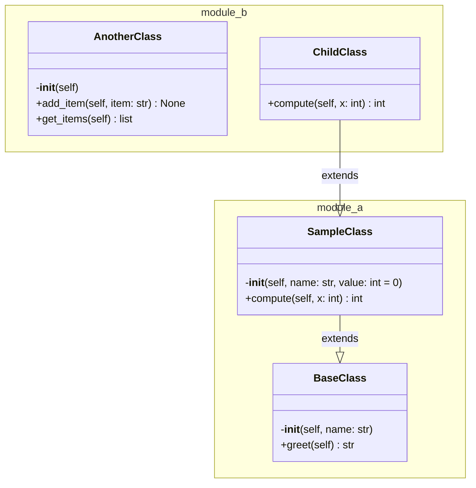

# M2A-452: Feature 2 - Mermaid Diagram Generation

## Test Execution

```bash
$ python -m csuite diagram --path ./sample_code --output architecture.mmd
Mermaid diagram written to architecture.mmd
```

## Generated Diagram (architecture.mmd)



## Verification Tests

### Test 1: Diagram Generation ✓
```bash
$ python -m csuite diagram --path ./sample_code --output architecture.mmd
Mermaid diagram written to architecture.mmd
```
**Result:** PASS

### Test 2: File Content Validation ✓
- Starts with `classDiagram` ✓
- Contains namespace grouping ✓
- Includes class methods ✓
- Shows inheritance edges ✓
- Valid Mermaid syntax ✓

**Result:** PASS

### Test 3: Feature 1 Regression Test ✓
```bash
$ python -m csuite parse --path ./sample_code
Found 3 modules, 4 classes, 11 functions, 3 imports
```
**Result:** PASS

## Summary
- **Status:** All tests passing ✓
- **Files Changed:** csuite/diagram.py
- **Feature Working:** Yes
- **Regressions:** None
